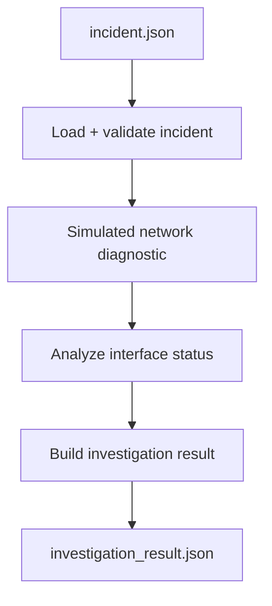

# NetGuardian Mini

NetGuardian Mini is a small Python network-incident investigation workflow built as the foundation for a larger AI-assisted network operations platform.

The current version deliberately keeps the workflow deterministic and easy to understand: it loads an incident from JSON, validates the required fields, calls a simulated network diagnostic tool, interprets the evidence, and saves a structured investigation report.

> **Project status:** Foundation / learning milestone. This mini version does not yet connect to production network devices and does not yet use an LLM, RAG, or an AI agent. Those integrations are part of the NetGuardian roadmap below.

## Why I built it

Network support engineers often need to turn an incoming incident into a repeatable investigation: validate the request, identify the device, gather evidence, interpret the result, and record the outcome. NetGuardian Mini models that workflow while providing a practical way to learn the Python concepts required for network automation and, later, agentic AI.

## Current workflow



## Features

- Loads incident data from an external JSON file.
- Validates required incident fields before investigation continues.
- Handles missing files and malformed JSON gracefully.
- Uses separate Python modules for ticket validation and network diagnostics.
- Uses type hints and docstrings to make functions easier to understand and maintain.
- Simulates retrieving interface evidence for an incident device.
- Converts network evidence into a simple probable diagnosis.
- Writes the completed investigation as structured JSON.

## Project structure

```text
netguardian_mini/
├── data/
│   └── incident.json
├── main.py
├── network_tools.py
├── ticket_tools.py
├── .gitignore
└── README.md
```

`data/investigation_result.json` is created when the program runs and is intentionally ignored by Git.

## Example incident

```json
{
  "incident_id": "Inc-001",
  "site": "Toronto",
  "device": "Tor-R1",
  "description": "Users can't reach CRM application",
  "severity": "High"
}
```

## Example run

```text
Validation result: VALID
Network diagnostic result: {'device': 'Tor-R1', 'interface': 'eth0', 'status': 'Down'}
Network analysis result: Interface down
Report saved
```

The generated report is structured like this:

```json
{
  "incident": {
    "incident_id": "Inc-001",
    "site": "Toronto",
    "device": "Tor-R1",
    "description": "Users can't reach CRM application",
    "severity": "High"
  },
  "validation": "VALID",
  "network_evidence": {
    "device": "Tor-R1",
    "interface": "eth0",
    "status": "Down"
  },
  "diagnosis": "Interface down"
}
```

## Run locally

### Prerequisites

- Python 3 installed. This project was developed and tested with Python 3.13.14.
- Git is required only if you want to clone or contribute to the repository.

### Windows PowerShell

```powershell
py -m venv .venv
.\.venv\Scripts\Activate.ps1
python main.py
```

The mini version currently uses only the Python standard library, so there are no third-party runtime dependencies to install.

## Python concepts demonstrated

- Variables and Python data types
- Lists and dictionaries
- Nested dictionaries
- Conditions and loops
- Functions, parameters, arguments, and return values
- Modules and imports
- Type hints and docstrings
- File handling with `open()` and `with`
- JSON parsing with `json.load()`
- JSON output with `json.dump()`
- Exception handling with `try` / `except`
- Safe termination with `sys.exit()` when required input is invalid

## Roadmap: from Mini to NetGuardian AI

The larger project is intended to evolve this foundation into an evidence-driven, AI-assisted network operations workflow.

Planned capabilities include:

1. **Cisco vulnerability assessment** — query Cisco PSIRT OpenVuln data and determine which software versions are affected by published security advisories.
2. **Real inventory integration** — obtain device/platform/software information from sources such as Cisco Catalyst Center or NetBox instead of hard-coded inventory.
3. **Live network evidence** — use Cisco pyATS/Genie and controlled device APIs to collect and validate operational state.
4. **Lab change assurance** — validate proposed remediation in Cisco Modeling Labs or a staging environment before any production change.
5. **RAG grounding** — retrieve relevant Cisco documentation, enterprise runbooks, security policies, and remediation procedures.
6. **LLM/agent orchestration** — use an LLM to reason over retrieved knowledge and verified tool evidence, while deterministic tools remain the source of truth for network state.
7. **Human approval gates** — require engineer approval before any production-changing action.
8. **Post-change verification** — confirm the target version, network health, and vulnerability remediation after a controlled rollout.

## Safety and design principles

- Never treat an LLM as the source of truth for device state or vulnerability applicability.
- Keep credentials and secrets out of source code and Git history.
- Use read-only integrations where possible during investigation.
- Validate changes in a representative lab/staging environment before production.
- Require human approval for production-changing actions.
- Preserve evidence so assessments and remediation decisions are auditable.

## Current limitations

- Network interface status is currently simulated.
- No live Cisco device or inventory integration exists in this mini version.
- No Cisco PSIRT integration exists in this mini version.
- No LLM, RAG, MCP, or agent framework is used yet.
- The diagnosis logic is intentionally simple while the Python foundation is being established.

These limitations are explicit so future milestones can demonstrate measurable progression from a deterministic Python workflow to a production-minded agentic network operations platform.

