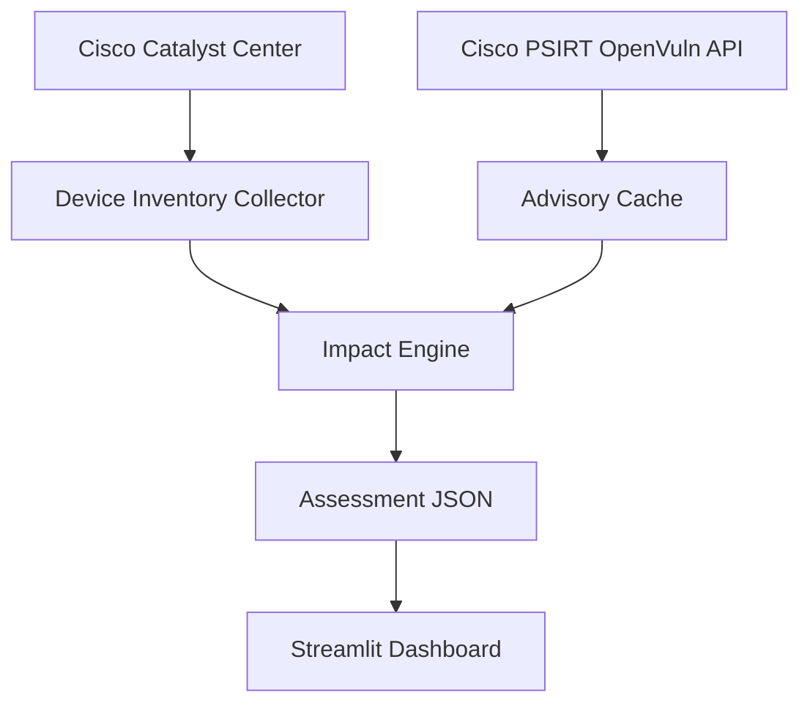

# NetGuardian Vulnerability Intelligence Dashboard

NetGuardian is a network-security analytics application that combines Cisco Catalyst Center device inventory with Cisco PSIRT security advisories.

It identifies network devices that may be affected by published vulnerabilities, presents the results through an interactive Streamlit dashboard, and provides fixed-release information to support remediation and lab-upgrade planning.

## Problem Statement

Network support engineers often need to answer several questions after Cisco publishes a security advisory:

- Which Cisco devices are deployed in the network?
- Which operating systems and software versions are installed?
- Which devices may be affected?
- How severe are the associated vulnerabilities?
- Which fixed releases should be evaluated?
- Which devices should be prioritized for lab testing and remediation?

Performing this correlation manually across inventory systems and Cisco advisories is time-consuming and error-prone.

NetGuardian automates the initial data collection, correlation and visualization process.

## Key Features

- Retrieves network-device inventory from Cisco Catalyst Center
- Authenticates with the Cisco PSIRT OpenVuln API
- Normalizes operating-system names and software versions
- Avoids duplicate API requests by querying each unique OS/version once
- Correlates Cisco advisories with devices running the affected version
- Classifies results as `Potentially affected`
- Displays interactive metrics, filters, charts and tables
- Shows CVSS scores, CVEs and first-fixed releases
- Provides links to the original Cisco security advisories
- Exports filtered assessment results as CSV
- Supports an offline demonstration dataset for reviewers without API credentials

## Current Demonstration Results

The included demonstration dataset contains:

- 4 Cisco Catalyst devices
- 64 unique Cisco security advisories
- 37 Critical or High severity advisories
- 91 unique CVEs
- 256 device-to-advisory assessment relationships

One Cisco advisory may contain multiple CVEs. One advisory may also apply to multiple devices, which is why assessment-row counts can exceed advisory counts.

## Architecture



## Assessment Workflow

1. Retrieve device inventory from Cisco Catalyst Center.
2. Extract hostname, model, role, reachability, OS type and installed version.
3. Normalize Catalyst values into the format expected by Cisco PSIRT.
4. Identify unique OS/version combinations.
5. Query Cisco PSIRT once per unique combination.
6. Associate returned advisories with devices using that version.
7. Save a structured vulnerability-assessment dataset.
8. Visualize the results through Streamlit.

## Important Interpretation

`Potentially affected` does not mean that exposure has been conclusively confirmed.

A final vulnerability decision may also require verification of:

- Exact hardware platform
- Enabled features
- Device configuration
- Advisory-specific prerequisites
- Cisco bug and product information
- Recommended fixed software release

NetGuardian supports triage and remediation planning. It does not automatically modify or upgrade production devices.

## Project Structure

```text
netguardian_mini/
├── data/
│   ├── incident.json
│   └── sample_vulnerability_assessment.json
├── catalyst_inventory.py
├── cisco_psirt.py
├── dashboard.py
├── impact_engine.py
├── main.py
├── network_tools.py
├── ticket_tools.py
├── requirements.txt
├── .env.example
├── .gitignore
└── README.md
```

Generated live inventory and vulnerability files are excluded from Git to avoid publishing environment-specific data.

## Technology Stack

- Python
- Streamlit
- pandas
- Requests
- python-dotenv
- Cisco Catalyst Center REST API
- Cisco PSIRT OpenVuln API
- JSON
- Git and GitHub

## Run the Dashboard Using Sample Data

The included sample dataset lets reviewers run the dashboard without Cisco credentials.

### 1. Clone the repository

```powershell
git clone https://github.com/SimarSidhu27/netguardian-mini.git
cd netguardian-mini
```

### 2. Create a virtual environment

```powershell
py -m venv .venv
```

### 3. Activate it

```powershell
.\.venv\Scripts\Activate.ps1
```

### 4. Install dependencies

```powershell
python -m pip install -r requirements.txt
```

### 5. Start Streamlit

```powershell
python -m streamlit run dashboard.py
```

Open the displayed local URL, normally:

```text
http://localhost:8501
```

If no live assessment file exists, the dashboard automatically uses `data/sample_vulnerability_assessment.json`.

## Run the Live API Workflow

### 1. Create an environment file

Copy `.env.example` to `.env` and provide the required credentials.

### 2. Collect Catalyst inventory

```powershell
python catalyst_inventory.py
```

This generates:

```text
data/device_inventory_snapshot.json
```

### 3. Generate the vulnerability assessment

```powershell
python impact_engine.py
```

This generates:

```text
data/vulnerability_assessment.json
```

### 4. Start the dashboard

```powershell
python -m streamlit run dashboard.py
```

When the live assessment exists, the dashboard uses it instead of the sample dataset.

## Dashboard Capabilities

The dashboard provides:

- Total displayed devices
- Potentially affected device count
- Unique advisory count
- Critical and High advisory count
- Unique CVE count
- Severity distribution chart
- Affected devices by software version
- Device inventory overview
- Detailed device-to-advisory results
- Site, model, version, severity and status filters
- Cisco advisory links
- Filtered CSV download

## Data Sources

- [Cisco PSIRT OpenVuln API](https://developer.cisco.com/docs/psirt/)
- [Cisco Catalyst Center API](https://developer.cisco.com/docs/catalyst-center/)
- [Cisco Catalyst Center Sandbox](https://developer.cisco.com/docs/catalyst-center/sandboxes/)

The Cisco Catalyst Center Always-On Sandbox is a shared development environment. Its inventory is demonstration data and should not be treated as a production network.

## Security Practices

- API credentials are loaded from environment variables.
- `.env` is excluded through `.gitignore`.
- Access tokens are never printed or saved.
- Runtime inventory and assessment files are excluded from Git.
- A demonstration dataset is provided for reviewers.
- TLS verification is disabled only for the current Cisco sandbox certificate behavior and must remain enabled in production.

## Limitations

- Results are version-based and require platform/configuration verification.
- The current dashboard does not automatically upgrade devices.
- The shared Catalyst sandbox cannot be used for production-change testing.
- API availability and rate limits can affect live refreshes.
- Lab validation is planned but is outside the Week 1 MVP.

## Future Enhancements

- Cisco Modeling Labs integration
- pyATS pre-upgrade and post-upgrade validation
- Interface, routing-neighbor and reachability health checks
- Fixed-release recommendation workflow
- Remediation approval tracking
- Historical vulnerability trends
- Scheduled inventory and advisory refresh
- LLM-generated incident summaries grounded through RAG
- ServiceNow or Jira ticket integration
- Role-based access control

## AI-Assisted Development

This project was built through an AI-assisted development workflow for the Gen Academy Mastering Agentic AI Bootcamp Week 1 project.

AI was used as a collaborative coding partner to:

- Break the business problem into smaller components
- Explain Python concepts
- Review and correct implementation logic
- Troubleshoot API and data-format issues
- Improve error handling and project structure
- Generate and refine the Streamlit dashboard
- Document assumptions, limitations and future improvements

The application integrates real Cisco APIs and an independently designed networking use case. AI supported the development process; it did not replace the engineering decisions, validation and iterative learning involved in building the project.

## Disclaimer

This project is intended for learning, portfolio demonstration and security-triage support. Validate all vulnerability and remediation decisions against the latest official Cisco advisory and test changes in an approved lab before production deployment.

## Author

Simar Sidhu
